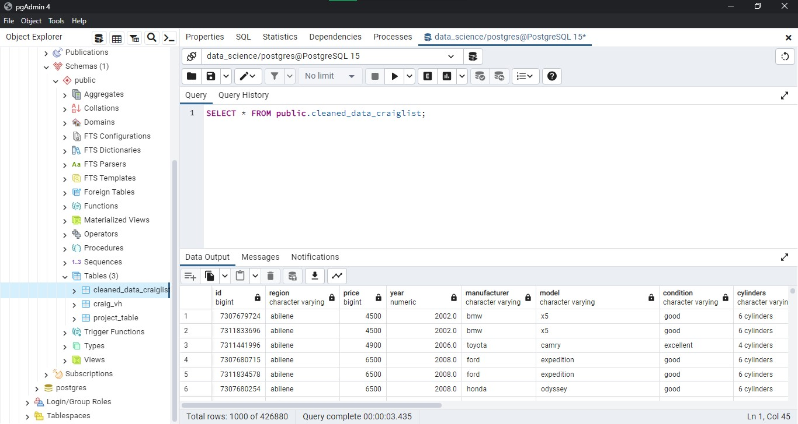
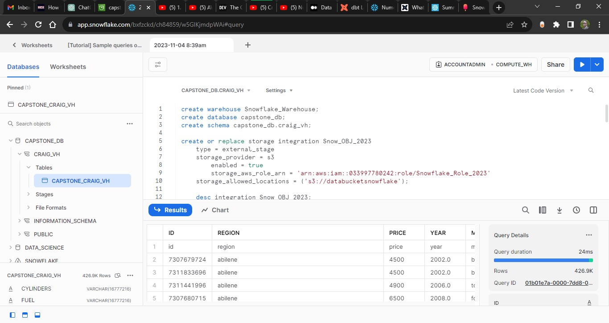

Week 5: Capstone Project -
After Performing Time Series Analysis here: https://github.com/Mikeoduoli/Data-Science-Repo/blob/main/Time_Series_Project.ipynb;

The final project entails loading a csv file to local database - PostgreSQL is used in this task:

Later on the data is moved from local database to Snowflake for Data warehousing via Amazon S3:

